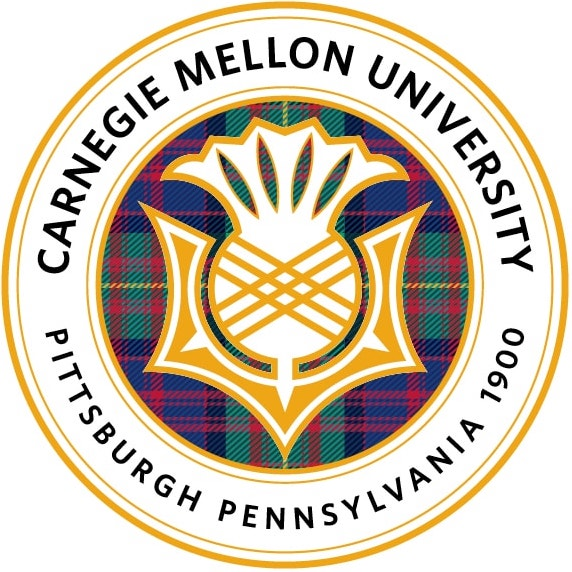

<!-- ## [*Click Here for my Blog*](./blog.html) -->

## About Me

I am an incoming PhD student for the [Safe AI Lab](https://safeai-lab.github.io/){:target="_blank"} at Carnegie Mellon University, advised by [Prof. Ding Zhao](https://www.meche.engineering.cmu.edu/directory/bios/zhao-ding.html){:target="_blank"}. I recieved my BA in Psychological Science at the University of California, Irvine. Currently, my research interest is in multimodal learning for cognition, robotics, and healthcare. I am also interested in translation, alignment, fusion, co-learning, and representation of multimodal data.

When I am not doing research, I like to hang out with my [friends](https://www.instagram.com/wearchives/){:target="_blank"}, [read](https://www.gutenberg.org/files/996/996-h/996-h.htm){:target="_blank"}, [learn Mandarin](https://www.duolingo.com/learn){:target="_blank"}, and watch [YouTube videos](https://www.youtube.com/watch?v=gEmHmlXrWdU){:target="_blank"}. 

I love meeting new people so please do not hesitate to reach out to wjhan{at}andrew{dot}cmu{dot}edu.

### Education

Carnegie Mellon University - Mechanical Engineering PhD Sep. 2023

University of California, Irvine - Psychological Science BA Sep. 2020 - Jun. 2022

## Events

* I will be joining Carnegie Mellon University's [Safe AI Lab](https://safeai-lab.github.io/){:target="_blank"} as a PhD student this coming Fall! Sep. 2023
* One paper accepted by EACL 2023  Jan. 2023
* Started working at [Honda Research Institue (HRI)](https://usa.honda-ri.com/){:target="_blank"} as a Research Intern  Oct. 2022 - Apr. 2023
* Started working at [Foretify.ai](https://www.foretify.ai/){:target="_blank"} as a Machine Learning Engineer Intern  Jun. 2022 - Oct. 2022
* Participated in [UCI's ML Hackathon 2022](https://uci-ml-repo.github.io/events/hackathon22/){:target="_blank"}  May 2022 - Jun. 2022
* Participated in [AI LA's Open Innovation Challenge 2022](https://www.joinai.la/events/open-innovation-challenge-spring-2022){:target="_blank"} - [pests.ai](https://github.com/willxxy/AILAOI){:target="_blank"} Mar. 2022 - Apr. 2022
* Started research at Carnegie Mellon University's [Safe AI Lab](https://safeai-lab.github.io/){:target="_blank"} as a Research Intern   Mar. 2022 - Mar. 2023
* Started research at [UCI's Center for Artifical Intelligence in Diagnostic Medicine (CAIDM)](https://www.caidm.som.uci.edu/){:target="_blank"} as a Research Intern   Dec. 2021 - Nov. 2022

## Publications and Preprints 
* denotes equal contribution

Embodied Executable Policy Learning with Language-based Scene Summarization 
[Jielin Qiu*](https://www.cs.cmu.edu/~jielinq/){:target="_blank"}, [Mengdi Xu*](https://mxu34.github.io/){:target="_blank"}, **William Han***, [Seungwhan Moon](https://shanemoon.com/){:target="_blank"}, [Ding Zhao](https://www.meche.engineering.cmu.edu/directory/bios/zhao-ding.html){:target="_blank"} 
Under Review / [arxiv](https://arxiv.org/abs/2306.05696){:target="_blank"}

MultiSum: A Dataset for Multimodal Summarization and Thumbnail Generation of Videos 
[Jielin Qiu](https://www.cs.cmu.edu/~jielinq/){:target="_blank"}, [Jiacheng Zhu](https://jiachengzhuml.github.io/){:target="_blank"}, **William Han**, [Aditesh Kumar](https://aramuk.github.io/){:target="_blank"}, [Karthik Mittal](https://www.linkedin.com/in/karthikmittal/){:target="_blank"}, [Claire Jin](https://www.linkedin.com/in/claire-jin-a1474420a/){:target="_blank"}, [Zhengyuan Yang](https://zyang-ur.github.io/){:target="_blank"}, [Linjie Li](https://scholar.google.com/citations?user=WR875gYAAAAJ&hl=en){:target="_blank"}, [Jianfeng Wang](https://scholar.google.com/citations?user=vJWEw_8AAAAJ&hl=en){:target="_blank"}, [Bo Li](https://aisecure.github.io/){:target="_blank"}, [Ding Zhao](https://www.meche.engineering.cmu.edu/directory/bios/zhao-ding.html){:target="_blank"}, [Lijuan Wang](https://scholar.google.com/citations?user=cDcWXuIAAAAJ&hl=zh-CN){:target="_blank"} 
Under Review / [arxiv](https://arxiv.org/abs/2306.04216){:target="_blank"} 

Converting ECG Signals to Images for Efficient Image-text Retrieval via Encoding 
[Jielin Qiu*](https://www.cs.cmu.edu/~jielinq/){:target="_blank"}, [Jiacheng Zhu*](https://jiachengzhuml.github.io/){:target="_blank"}, Shiqi Liu, **William Han**, Jingqi Zhang, Chaojing Duan, [Michael Rosenberg](https://scholar.google.com/citations?hl=en&user=o0Y0GLcAAAAJ){:target="_blank"}, [Emerson Liu](https://www.linkedin.com/in/emerson-liu-950479/){:target="_blank"}, [Douglas Weber](https://www.meche.engineering.cmu.edu/directory/bios/weber-douglas.html){:target="_blank"}, [Ding Zhao](https://safeai-lab.github.io/){:target="_blank"} 
Under Review / [arxiv](https://arxiv.org/abs/2304.06286){:target="_blank"} 

Transfer Knowledge from Natural Language to Electrocardiography: Can We Detect Cardiovascular Disease Through Language Models? 
[Jielin Qiu*](https://www.cs.cmu.edu/~jielinq/){:target="_blank"}, **William Han***, [Jiacheng Zhu](https://jiachengzhuml.github.io/){:target="_blank"}, [Mengdi Xu](https://mxu34.github.io/){:target="_blank"}, [Michael Rosenberg](https://scholar.google.com/citations?hl=en&user=o0Y0GLcAAAAJ){:target="_blank"}, [Emerson Liu](https://www.linkedin.com/in/emerson-liu-950479/){:target="_blank"}, [Douglas Weber](https://www.meche.engineering.cmu.edu/directory/bios/weber-douglas.html){:target="_blank"}, [Ding Zhao](https://safeai-lab.github.io/){:target="_blank"} 
**EACL 2023** / [arxiv](https://arxiv.org/abs/2301.09017){:target="_blank"}

An Empirical Exploration of Cross-domain Alignment between Language and Electroencephalogram 
**William Han***, [Jielin Qiu*](https://www.cs.cmu.edu/~jielinq/){:target="_blank"}, [Jiacheng Zhu](https://jiachengzhuml.github.io/){:target="_blank"}, [Mengdi Xu](https://mxu34.github.io/){:target="_blank"}, [Douglas Weber](https://www.meche.engineering.cmu.edu/directory/bios/weber-douglas.html){:target="_blank"}, [Bo Li](https://aisecure.github.io/){:target="_blank"}, [Ding Zhao](https://safeai-lab.github.io/){:target="_blank"} 
Under Review / [arxiv](https://arxiv.org/abs/2208.06348){:target="_blank"} 

## Accomplishments

* Graduate Research Fellowship from College of Engineering, CMU 2023 - 2028
* [UCI's ML Hackathon 2022 Runner Up (2nd Place)](https://www.cs.uci.edu/uci-ml-repository-highlights-four-impactful-projects-at-2022-ml-hackathon/){:target="_blank"}
* [AI LA Open Innovation Challenge Runner Up (2nd Place)](https://devpost.com/software/pests-ai){:target="_blank"} 
* Project Proposal Winner for the [AI Club at UCI](https://aiclub.ics.uci.edu){:target="_blank"}
* [Member of the Year Award](https://campusorgs.uci.edu/awards/){:target="_blank"}
* Dean's List 2018 - 2022

## Services

* **Reviewer:** CVPR (2023), NeurIPS (2023), ICML (2023)

* * *
